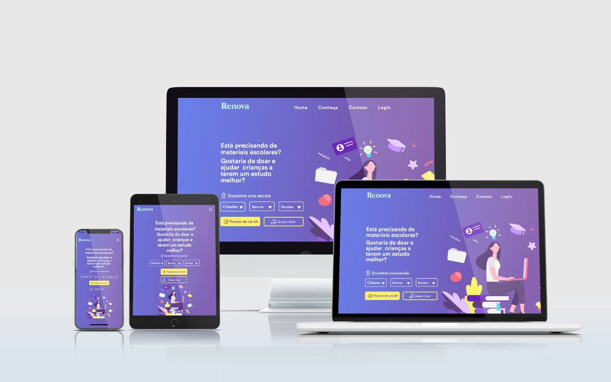

# Renova - Facilitando o reaproveitamento de materiais escolares

<p align="center">
 <a href="#a-renova">A Renova</a> •
 <a href="#o-que-é-esse-hackathon">O que é esse Hackathon</a> •
 <a href="#squad">Squad</a> • 
 <a href="#o-desafio">O Desafio</a> •
 <a href="#demonstração-da-aplicação">Demonstração da aplicação</a> •
 <a href="#tecnologias">Tecnologias</a> • 
 <a href="#pré-requisitos">Pré-requisitos</a> • 
 <a href="#licença">Licença</a>
</p>

<h1 align="center">
  
</h1>

## A Renova

A Renova é uma aplicação web, baseada em um estudo de caso proposto pelo Grupo FCamara, no Hackathon 2021 Season 1.

[Link para o Artigo sobre a Renova](https://medium.com/renova-utilizando-processos-de-ux-para-ajudar-pais/renova-facilitando-o-reaproveitamento-de-materiais-escolares-5804eb394cdc)

## O que é esse Hackathon?

O Hackathon do Programa de Formação da FCamara é a fase onde os participantes colocarão em prática toda a teoria que vem aprendendo. Iremos te dar um desafio, e seu objetivo será transformá-lo em uma solução. Ao final do Hackathon, os participantes sairão com um case/portfólio para poder divulgar, e de quebra, um emprego! =P

## Squad

O squad (time) deste projeto foi composto por 2 UX Designers e 2 desenvolvedores Front-end e Back-end.

## O Desafio

**Problemática:**

"Sabemos o quanto é complicado para os pais poderem comprar material escolar para seus filhos. Os preços aumentam de semestre para semestre. Principalmente quando falamos de educação pública, onde a dificuldade é ainda maior e vem por diversos fatores..."

**Proposta:**

Criar uma aplicação, onde os pais irão cadastrar seus filhos que estudam em escolas estaduais e municipais, e também a lista de material escolar que precisam e não tem condições de comprar. Usuários avulsos e anônimos podem acessar, buscar a escola com base em alguns critérios de busca, visualizar a necessidade dos alunos carentes e fazer a doação dos itens que um determinado aluno esteja precisando.

## Demonstração da Aplicação

Para acessar a aplicação, clique neste link -> [Renova](https://fcamara-hackathon-2021.github.io/hackathon-squad19/)

### Features

- [x] Preciso de um kit
- [ ] Quero doar
- [ ] Cadastro de alunos
- [ ] Cadastro de doares
- [ ] Cadastro de materiais
- [ ] Conheça

## Tecnologias

As seguintes ferramentas foram usadas na construção do projeto:

- [Bootstrap v5.0](https://getbootstrap.com/)
- [jQuery](https://jquery.com/)
- [Bootstrap-Select v1.14-dev](https://github.com/snapappointments/bootstrap-select)
- [JSON](https://www.json.org/json-en.html)

## Pré-requisitos

Antes de começar, você vai precisar ter instalado em sua máquina o [Git](https://git-scm.com)

Além disto, é bom ter um editor para trabalhar com o código como o [VSCode](https://code.visualstudio.com/)

### 🎲 Acessando o Projeto Localmente

```bash
# Clone este repositório
$ git clone <https://github.com/FCamara-Hackathon-2021/hackathon-squad19.git>

# Acesse a pasta do projeto no terminal/cmd
$ cd hackathon-squad19

# Abra o projeto pelo Visual Studio Code
$ code .
```


## Licença

Este projeto está sob a licença MIT. Consulte o [LICENSE](./LICENSE.md) para obter mais informações.
